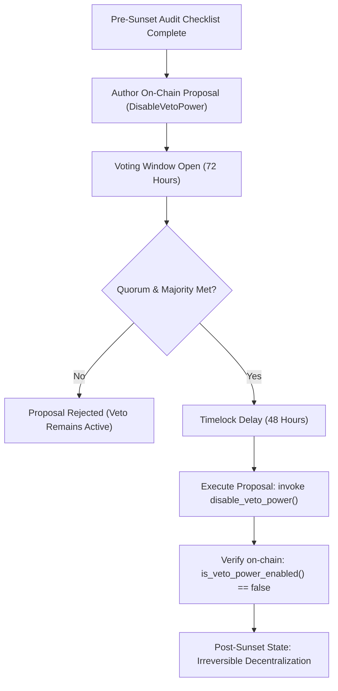

# Decentralization Roadmap: Veto-Power Sunset Path

**Status:** Proposed Architecture Specification  
**Target Milestone:** Post-Mainnet Decentralization Phase 4  
**Primary References:** [ADR-005 (Governance Timelock)](adr/ADR-005-governance-timelock.md), [ADR-008 (Multisig Admin)](adr/adr-008-multisig-admin.md), [ADR-012 (Authority Handoff Plan)](adr/ADR-012-governance-multisig-handoff.md), [Threat Model §E](threat-model.md)  
**Tracking Issues:** Issue #5 (Multisig-gating veto), Issue #9 / #646 (Authority handoff plan), Issue #770 (Veto-power sunset path)

---

## 1. Executive Summary & Problem Context

The `iln_governance` smart contract includes an on-chain admin veto mechanism (`veto_proposal`), which allows the designated protocol administration to unilaterally abort an `Active` or `Passed` governance proposal before it can be executed. 

The test suite formally validates this capability:
- `test_veto_power_enabled_after_init`: Verifies that veto authority is active upon protocol genesis.
- `test_disable_veto_power_succeeds`: Validates that governance (via the authorized ILN contract call) possesses the operational capability to permanently disable admin veto power via `disable_veto_power()`.
- `test_veto_after_disable_returns_error`: Confirms that subsequent veto invocations are rejected with `GovernanceError::VetoPowerDisabled`.

However, as highlighted in the threat model and ADR-012, **veto disabling currently exists as an isolated contract capability without a concrete post-launch trigger framework**. Calling `disable_veto_power()` is a strict **one-way, irreversible state transition** (`VetoPowerEnabled := false`). If executed prematurely before decentralization prerequisites are met, the protocol is left vulnerable to malicious proposal execution, flash-loan balance manipulation, or low-quorum capture.

This document establishes the quantitative trigger criteria, prerequisite safety gates, operational procedures, and post-sunset verification required to responsibly sunset the admin veto.

---

## 2. Cross-Architecture Dependencies

The veto sunset path cannot be evaluated in isolation. It depends directly on three foundational architectural pillars:

```
┌─────────────────────────────────────────────────────────────────────────┐
│                          Decentralization Spine                         │
└─────────────────────────────────────────────────────────────────────────┘
                                   │
      ┌────────────────────────────┼────────────────────────────┐
      ▼                            ▼                            ▼
 [Issue #5 / ADR-008]     [ADR-005 / Timelock]        [Issue #9 / ADR-012]
 Contract Multisig         Execution Delay Guard       Authority Handoff
 M-of-N emergency pause    Enforces delay on execute   Phased transition from
 replaces unilateral key   before veto is revoked      admin to token DAO
```

### 2.1 Issue #5 & ADR-008: Multisig-Gated Emergency Response
- **Role:** The admin veto initially serves as an emergency stop for malicious proposals. To retire it safely, the protocol must first activate contract-level M-of-N multisig emergency pause capabilities (`propose_pause`, `execute_proposal` in `multisig.rs`).
- **Invariance:** Veto power must *never* be disabled while protocol emergency response relies on a single admin key. Emergency pause must be proven as the operative defense-in-depth replacement.

### 2.2 Issue #9 & ADR-012: Phased Authority Handoff
- **Phase 1 (Multisig Wiring):** Wire `multisig.rs` entry points into `invoice_liquidity::lib.rs`.
- **Phase 2 (Expanded Parameter Authority):** Expand `iln_governance` to manage core parameters (fee rates, discounts, reputation limits).
- **Phase 3 (Timelock Enforcement):** Activate `TimelockNotExpired` enforcement against `execution_delay >= 48h`.
- **Phase 4 (Veto Sunset):** Trigger the `disable_veto_power()` governance action.
- **Phase 5 (Autonomous DAO):** Reassign `invoice_liquidity` Admin address directly to `iln_governance`.

---

## 3. Quantitative Veto Sunset Trigger Criteria

Before a proposal to call `disable_veto_power()` may be submitted to on-chain voting, all six of the following quantitative and qualitative criteria must be satisfied:

| # | Domain | Trigger Requirement | Validation Method |
|---|---|---|---|
| **C1** | **Mainnet Stability Window** | Minimum **6 months** (180 days) of continuous, incident-free mainnet operation with zero unhandled contract panics or security rollbacks. | On-chain ledger timestamps & security incident log. |
| **C2** | **Total Value Locked (TVL)** | Sustained TVL exceeding **$5,000,000 USDC equivalent** maintained across at least 30 consecutive calendar days without severe liquidity drains. | On-chain vault reserves & indexer reconciliation audit. |
| **C3** | **Governance Decentralization** | Token distribution Gini coefficient < 0.65; no single entity or affiliated cluster controls > 20% of circulating voting power (evaluated net of composable lending pools per threat model §E3). | Token distribution snapshot analysis. |
| **C4** | **Proven Voting Quorum** | At least **5 major governance proposals** successfully passed and executed with >= 25% circulating voting participation, with quadratic voting verified in production. | `GovContract` event history (`ProposalExecuted`). |
| **C5** | **Timelock Enforced** | `execution_delay` parameter is configured to **>= 48 hours** (172,800 seconds), providing token holders sufficient time to exit if a controversial proposal passes. | `get_execution_delay() >= 172_800`. |
| **C6** | **External Security Audit** | Formal smart contract audit of `iln_governance` and `invoice_liquidity` completed by an independent top-tier auditor with 0 open High/Critical findings. | Published audit report & remediation verification. |

---

## 4. Veto Sunset Execution Lifecycle



### Step 1: Pre-Proposal Certification
The core engineering team and governance working group verify and sign off that criteria **C1 through C6** are completely met, publishing the verification artifacts to IPFS and the governance forum.

### Step 2: On-Chain Proposal Submission
A token holder meeting the minimum proposal threshold submits a proposal with target action `DisableVetoPower`.
- Proposal specifies the justification hash and links to the criteria sign-off document.
- Proposer voting balance is checkpointed.

### Step 3: Voting & Timelock Period
- Voting window opens for standard duration (72 hours).
- If passed, the proposal enters the mandatory execution delay timelock (48 hours) introduced in ADR-012 Phase 3.

### Step 4: Atomic Execution
The proposal is executed on-chain:
```rust
// Invocation via cross-contract authorization
t.contract.disable_veto_power();
```
- Sets storage key `DataKey::VetoPowerEnabled` to `false`.
- Emits standard `VetoPowerDisabled` audit event.

### Step 5: On-Chain Invariant Verification
Post-execution automated test suites and monitoring indexers assert:
1. `is_veto_power_enabled() == false`.
2. Any subsequent invocation of `veto_proposal(...)` deterministically aborts with `GovernanceError::VetoPowerDisabled`.

---

## 5. Security Invariants & Rollback Analysis

### 5.1 The Irreversibility Invariant
`disable_veto_power()` is deliberately designed with no counter-function:
```rust
// In contracts/iln_governance/src/lib.rs
pub fn disable_veto_power(env: Env) -> Result<(), GovernanceError> {
    require_iln_contract(&env)?;
    env.storage().instance().set(&DataKey::VetoPowerEnabled, &false);
    Ok(())
}
```
There is no `enable_veto_power()` method. Once disabled, neither the original admin account nor governance can re-enable unilateral veto authority without a full contract upgrade.

### 5.2 Rollback / Disaster Recovery Strategy
If catastrophic governance capture occurs *after* veto power has been sunset:
1. **Multisig Circuit Breaker (ADR-008):** The M-of-N emergency multisig can execute `pause()` on `invoice_liquidity`, halting deposits, payments, and settlements.
2. **Coordinated Contract Upgrade:** The community and emergency signers coordinate an authorized contract upgrade or deploy a migration contract with updated governance parameters.
3. **No Unilateral Backdoor:** By explicitly removing the veto backdoor, the protocol ensures that even the founding team cannot censor legitimate governance actions, fulfilling the decentralization commitment of the Stellar Community Fund.

---

## 6. Testing & Automated Verification Suite

The veto lifecycle and sunset transition are formally covered by test cases in `contracts/iln_governance/src/test.rs`:

```rust
#[test]
fn test_disable_veto_power_succeeds() {
    let t = setup();
    // Verify initial active state
    assert!(t.contract.is_veto_power_enabled());
    
    // Execute sunset action via authorized governance path
    t.contract.disable_veto_power();
    
    // Verify disabled state
    assert!(!t.contract.is_veto_power_enabled());
}

#[test]
fn test_veto_after_disable_returns_error() {
    let t = setup();
    let id = create_fee_proposal(&t);

    // Disable veto power
    t.contract.disable_veto_power();

    // Verify admin cannot veto post-sunset
    let res = t.env.as_contract(&t.contract.address, || {
        GovContract::veto_proposal(t.env.clone(), id, reason_hash(&t.env))
    });
    assert_eq!(res, Err(GovernanceError::VetoPowerDisabled));
}
```

These tests guarantee that the contract transitions safely and irreversibly when the decentralization criteria are satisfied.
